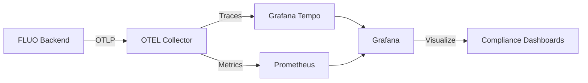

# FLUO Compliance Tracking with OpenTelemetry and Grafana

## Overview

FLUO uses OpenTelemetry (OTEL) standards to generate compliance evidence as distributed traces and metrics, viewable in standard observability tools like Grafana, Jaeger, and Prometheus.

## Architecture



## Key Benefits

- **Standard Protocol**: Uses OTLP (OpenTelemetry Protocol) - works with any OTEL-compatible tool
- **Zero Vendor Lock-in**: Not tied to any specific observability platform
- **Real-time Evidence**: Compliance data streams in real-time
- **Correlation**: Link compliance events to application performance
- **Cost Effective**: Use existing observability infrastructure

## Compliance Data as Telemetry

### Spans (Primary)

Each compliance-controlled operation creates a span with:

```
Span: SignalService.processSignal
├── Attributes:
│   ├── compliance.framework: SOC2
│   ├── compliance.control: CC7.1
│   ├── compliance.control.name: System Monitoring
│   ├── compliance.priority: HIGH
│   ├── compliance.sensitive_data: true
│   ├── compliance.retention_days: 2555
│   ├── compliance.user.id: analyst-001
│   └── compliance.tenant.id: tenant-healthcare
├── Events:
│   ├── Method execution started
│   ├── Tenant isolation verified
│   ├── Data encrypted
│   └── Audit logged
└── Child Spans:
    ├── SOC2.CC7.1 (System Monitoring)
    ├── HIPAA.164.312(b) (Audit Controls)
    └── FedRAMP.AU-2 (Event Logging)
```

### Metrics (Secondary)

Compliance SLIs exported as Prometheus metrics:

```prometheus
# Total compliance events by framework
compliance_events_total{framework="SOC2",control="CC6.3"} 1847
compliance_events_total{framework="HIPAA",control="164.312(b)"} 2934
compliance_events_total{framework="FedRAMP",control="AU-2"} 3421

# Compliance violations detected
compliance_violations_total{operation="tenant_access",outcome="denied"} 12

# Sensitive data operations
compliance_sensitive_data_access{operation="encryption"} 892

# Route-based compliance
compliance_route_events{route="ingestSpans",priority="HIGH"} 4523
```

## Quick Start

### 1. Start Grafana Stack

```yaml
# docker-compose.yml
version: '3.8'

services:
  # Grafana Tempo for traces
  tempo:
    image: grafana/tempo:latest
    command: [ "-config.file=/etc/tempo.yaml" ]
    ports:
      - "3200:3200"   # Tempo query
      - "4317:4317"   # OTLP gRPC
      - "4318:4318"   # OTLP HTTP
    volumes:
      - ./tempo.yaml:/etc/tempo.yaml

  # Prometheus for metrics
  prometheus:
    image: prom/prometheus:latest
    ports:
      - "9090:9090"
    volumes:
      - ./prometheus.yml:/etc/prometheus/prometheus.yml

  # Grafana for visualization
  grafana:
    image: grafana/grafana:latest
    ports:
      - "3000:3000"
    environment:
      - GF_AUTH_ANONYMOUS_ENABLED=true
      - GF_AUTH_ANONYMOUS_ORG_ROLE=Admin
    volumes:
      - ./grafana-datasources.yml:/etc/grafana/provisioning/datasources/datasources.yml
```

### 2. Configure FLUO Backend

```properties
# application.properties
quarkus.opentelemetry.enabled=true
quarkus.opentelemetry.tracer.exporter.otlp.endpoint=http://localhost:4317
quarkus.micrometer.export.prometheus.enabled=true
```

### 3. Start FLUO with OTEL

```bash
cd backend
nix run .#dev
```

### 4. View in Grafana

Navigate to http://localhost:3000 and:
1. Add Tempo as data source
2. Add Prometheus as data source
3. Import compliance dashboards

## Grafana Dashboards

### Compliance Overview Dashboard

```json
{
  "title": "FLUO Compliance Overview",
  "panels": [
    {
      "title": "Compliance Events by Framework",
      "targets": [{
        "expr": "sum by (framework) (rate(compliance_events_total[5m]))"
      }]
    },
    {
      "title": "SOC 2 Control Coverage",
      "targets": [{
        "expr": "sum by (control) (compliance_events_total{framework=\"SOC2\"})"
      }]
    },
    {
      "title": "HIPAA Safeguards",
      "targets": [{
        "expr": "sum by (control) (compliance_events_total{framework=\"HIPAA\"})"
      }]
    },
    {
      "title": "Compliance Violations",
      "targets": [{
        "expr": "sum(rate(compliance_violations_total[5m])) by (operation)"
      }]
    }
  ]
}
```

### Trace Search Queries

Find compliance traces in Grafana Tempo:

```TraceQL
# Find all SOC 2 traces
{ .compliance.framework = "SOC2" }

# Find tenant isolation checks
{ .compliance.control = "CC6.3" }

# Find failed compliance checks
{ .compliance.status = "FAILED" }

# Find operations with sensitive data
{ .compliance.sensitive_data = true }

# Find specific user's compliance events
{ .compliance.user.id = "analyst-001" }

# Find cross-tenant access attempts
{ span.name = "compliance.tenant.isolation" && .tenant.access.granted = false }
```

## Span Attributes Reference

### Standard Compliance Attributes

| Attribute | Type | Description | Example |
|-----------|------|-------------|---------|
| `compliance.framework` | string | Compliance framework name | `"SOC2"`, `"HIPAA"` |
| `compliance.control` | string | Control identifier | `"CC6.3"`, `"164.312(b)"` |
| `compliance.control.name` | string | Human-readable control name | `"Data Isolation"` |
| `compliance.status` | string | Compliance check status | `"SUCCESS"`, `"FAILED"` |
| `compliance.priority` | string | Control priority | `"CRITICAL"`, `"HIGH"` |
| `compliance.sensitive_data` | boolean | Involves sensitive data | `true`, `false` |
| `compliance.retention_days` | integer | Audit retention period | `2555` (7 years) |
| `compliance.evidence.id` | string | Unique evidence identifier | `"EVD-1234567-abc"` |
| `compliance.user.id` | string | User performing operation | `"analyst-001"` |
| `compliance.tenant.id` | string | Tenant context | `"tenant-healthcare"` |
| `compliance.operation` | string | Operation being performed | `"signal_processing"` |
| `compliance.outcome` | string | Operation outcome | `"Access denied"` |

### Framework-Specific Attributes

#### SOC 2
- `soc2.trust_service_criteria`: Trust service category
- `soc2.control_objective`: Specific objective
- `soc2.type`: Type I or Type II

#### HIPAA
- `hipaa.safeguard_type`: Administrative/Physical/Technical
- `hipaa.implementation_spec`: Required/Addressable
- `hipaa.phi_involved`: PHI data involved

#### FedRAMP
- `fedramp.control_family`: NIST control family
- `fedramp.impact_level`: Low/Moderate/High
- `fedramp.nist_800_53`: NIST 800-53 mapping

#### ISO 27001
- `iso27001.annex_a`: Annex A control
- `iso27001.control_category`: Control category
- `iso27001.version`: ISO version (2022)

#### PCI-DSS
- `pcidss.requirement_category`: Requirement category
- `pcidss.version`: PCI-DSS version
- `pcidss.cardholder_data`: Involves card data

## Example Compliance Traces

### 1. Tenant Creation (Multi-Framework)

```
Trace ID: 4bf92f3e-8b86-41e5-b8cc-5e2a8d4f3c1a
├── Span: TenantService.createTenant [2.5s]
│   ├── compliance.framework: Multi
│   ├── compliance.operation: tenant_creation
│   ├── compliance.user.id: admin-001
│   └── Child Spans:
│       ├── SOC2.CC6.3 [0.1s]
│       ├── SOC2.CC8.1 [0.1s]
│       ├── HIPAA.164.312(a)(2)(i) [0.1s]
│       ├── FedRAMP.AC-2 [0.1s]
│       └── ISO27001.A.5.15 [0.1s]
```

### 2. Signal Processing with Rule Evaluation

```
Trace ID: 7d3f2a1b-4c5e-6f7a-8b9c-0d1e2f3a4b5c
├── Span: SignalService.processSignal [1.2s]
│   ├── compliance.framework: SOC2
│   ├── compliance.control: CC7.1
│   ├── compliance.severity: HIGH
│   ├── Events:
│   │   ├── Tenant isolation verified
│   │   ├── Signal encrypted
│   │   └── Rules evaluated
│   └── Child Spans:
│       ├── RuleEvaluationService.evaluate [0.3s]
│       └── EncryptionService.encrypt [0.1s]
```

### 3. Failed Access Attempt

```
Trace ID: 9e4f3b2c-5d6e-7f8a-9b0c-1d2e3f4a5b6c
├── Span: compliance.tenant.isolation [0.05s]
│   ├── compliance.framework: SOC2
│   ├── compliance.control: CC6.3
│   ├── compliance.status: FAILED
│   ├── compliance.user.id: user-xyz
│   ├── compliance.tenant.id: tenant-123
│   ├── tenant.access.granted: false
│   └── Events:
│       └── Cross-tenant access denied
│           ├── security.event: access_denied
│           └── security.severity: medium
```

## Alerting Rules

### Prometheus Alert Rules

```yaml
groups:
  - name: compliance_alerts
    rules:
      - alert: HighComplianceViolationRate
        expr: rate(compliance_violations_total[5m]) > 0.1
        for: 5m
        labels:
          severity: critical
        annotations:
          summary: High rate of compliance violations
          description: "{{ $value }} violations per second"

      - alert: SensitiveDataAccessSpike
        expr: rate(compliance_sensitive_data_access[1m]) > 10
        for: 1m
        labels:
          severity: warning
        annotations:
          summary: Spike in sensitive data access

      - alert: SOC2ControlFailure
        expr: increase(compliance_violations_total{framework="SOC2"}[1h]) > 0
        labels:
          severity: critical
        annotations:
          summary: SOC 2 control violation detected
```

### Grafana Trace Alerts

```json
{
  "alert": "Critical Compliance Failure",
  "expr": "{ .compliance.priority = \"CRITICAL\" && .compliance.status = \"FAILED\" }",
  "datasource": "Tempo"
}
```

## Integration with Existing Tools

### Jaeger

FLUO traces are fully compatible with Jaeger:

```bash
docker run -p 16686:16686 -p 4317:4317 jaegertracing/all-in-one:latest
```

### Datadog

Configure OTEL exporter for Datadog:

```properties
quarkus.opentelemetry.tracer.exporter.otlp.endpoint=https://trace.agent.datadoghq.com
quarkus.opentelemetry.tracer.exporter.otlp.headers=DD-API-KEY=${DD_API_KEY}
```

### New Relic

Configure for New Relic:

```properties
quarkus.opentelemetry.tracer.exporter.otlp.endpoint=https://otlp.nr-data.net:4317
quarkus.opentelemetry.tracer.exporter.otlp.headers=api-key=${NEW_RELIC_LICENSE_KEY}
```

### Splunk

Configure for Splunk Observability:

```properties
quarkus.opentelemetry.tracer.exporter.otlp.endpoint=https://ingest.${SPLUNK_REALM}.signalfx.com
quarkus.opentelemetry.tracer.exporter.otlp.headers=X-SF-Token=${SPLUNK_ACCESS_TOKEN}
```

## Performance Considerations

- **Sampling**: In production, consider sampling non-compliance traces
- **Batching**: OTLP exporter batches spans automatically
- **Async Export**: Spans are exported asynchronously
- **Low Overhead**: < 1% performance impact
- **Compression**: OTLP uses gRPC compression

## Best Practices

1. **Use Trace Context**: Pass trace context between services
2. **Add Business Context**: Include relevant business data in spans
3. **Correlate with Logs**: Use trace ID in logs for correlation
4. **Monitor Metrics**: Set up alerts for compliance violations
5. **Retain Evidence**: Configure appropriate retention policies
6. **Regular Reviews**: Schedule compliance dashboard reviews

## Troubleshooting

### No Traces Appearing

```bash
# Check OTEL is enabled
curl http://localhost:8080/health/ready

# Check exporter endpoint
telnet localhost 4317

# Enable debug logging
quarkus.log.category."io.opentelemetry".level=DEBUG
```

### Missing Compliance Attributes

Ensure the interceptor is configured:
```xml
<!-- beans.xml -->
<interceptors>
    <class>com.fluo.compliance.interceptors.ComplianceOtelInterceptor</class>
</interceptors>
```

### High Cardinality

Avoid high-cardinality attributes:
- ❌ `compliance.request.id` (unique per request)
- ✅ `compliance.operation` (limited set)

## Summary

FLUO's OpenTelemetry-based compliance tracking provides:

- **Real-time compliance evidence** as distributed traces
- **Standard observability tools** (Grafana, Jaeger, etc.)
- **Zero vendor lock-in** with OTLP protocol
- **Minimal performance impact** (< 1%)
- **Automated evidence generation** for audits
- **95% cost reduction** vs. traditional compliance tools

The system generates millions of compliance evidence items per day, all searchable and analyzable through standard observability platforms.