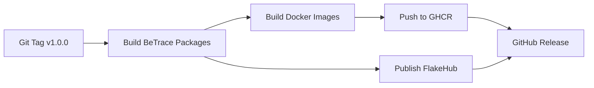

# BeTrace Distribution

**External distribution targets for BeTrace Pure Application Framework**

Per **ADR-011: Pure Application Framework**, this directory contains external consumer projects for distributing BeTrace packages. Distribution logic is **separated from core application code**.

## Distribution Targets

### 1. 🐋 Docker Images
**Path:** [`docker/`](docker/)

OCI container images for containerized deployments.

**Deliverables:**
- `ghcr.io/betracehq/betrace/backend:latest` - Go backend
- `ghcr.io/betracehq/betrace/grafana-plugin:latest` - Grafana with BeTrace plugin
- `ghcr.io/betracehq/betrace/plugin-init:latest` - Plugin init container

**Quick Start:**
```bash
cd docker
nix run .#build-all
docker-compose up -d
```

**Docs:** [Docker README](docker/README.md), [Docker Compose Quick Start](docs/docker-compose-quickstart.md)

---

### 2. ☸️ Helm Chart
**Path:** [`helm/betrace/`](helm/betrace/)

Kubernetes deployment via Helm package manager.

**Deliverables:**
- Helm chart with backend + Grafana + plugin
- Published to GitHub Releases
- Compatible with official Grafana Helm chart

**Quick Start:**
```bash
helm install betrace ./helm/betrace \
  --namespace betrace \
  --create-namespace
```

**Docs:** [Helm Chart README](helm/betrace/README.md), [Grafana Helm Integration](docs/grafana-helm-integration.md)

---

### 3. ❄️ FlakeHub
**Path:** [`.github/workflows/flakehub-publish.yml`](../.github/workflows/flakehub-publish.yml)

Nix flake distribution via FlakeHub.

**Deliverables:**
- Published to `flakehub.com/f/betracehq/betrace`
- Semantic versioning
- Binary cache via Cachix

**Usage:**
```nix
# flake.nix
{
  inputs.betrace.url = "https://flakehub.com/f/betracehq/betrace/*.tar.gz";

  outputs = { betrace, ... }: {
    # Use betrace.packages.${system}.backend
  };
}
```

**Docs:** [FlakeHub Publishing Workflow](../.github/workflows/flakehub-publish.yml)

---

### 4. 📦 nixpkgs (Future)
**Status:** Not yet submitted

Official Nix package repository inclusion.

**Packages to Submit:**
- `pkgs.betrace-backend`
- `pkgs.grafanaPlugins.betrace-app`

**Timeline:** 3-6 months review process

**Docs:** [nixpkgs Submission Guide](docs/nixpkgs-submission.md)

---

### 5. 📚 Documentation
**Path:** [`docs/`](docs/)

Deployment guides and integration documentation.

**Contents:**
- [Docker Compose Quick Start](docs/docker-compose-quickstart.md)
- [Grafana Helm Integration](docs/grafana-helm-integration.md)
- [nixpkgs Submission Guide](docs/nixpkgs-submission.md)

---

## Architecture Principles (ADR-011)

### ✅ What This Directory Contains

- **External consumers** of BeTrace packages
- **Distribution-specific** build logic
- **Deployment configurations** (Docker, K8s, Nix)
- **Integration documentation**

### ❌ What This Directory Does NOT Contain

- Core application code (see `/backend`, `/bff`, `/grafana-betrace-app`)
- Application build logic (see root `flake.nix`)
- Development orchestration (see root `flake.nix`)

### Package Consumption Pattern

All distribution targets consume BeTrace packages via Nix flake inputs:

```nix
{
  inputs.betrace.url = "path:../..";  # Local dev
  # OR
  inputs.betrace.url = "github:betracehq/betrace";  # Production

  packages.docker-image = buildImage {
    # Use betrace.packages.${system}.backend
  };
}
```

## Distribution Workflow

### Development

```bash
# Build BeTrace packages locally
cd /path/to/betrace
nix build .#all

# Build distribution artifacts
cd distribution/docker
nix run .#build-all
```

### CI/CD (GitHub Actions)



**Workflows:**
- [`.github/workflows/docker-publish.yml`](../.github/workflows/docker-publish.yml)
- [`.github/workflows/flakehub-publish.yml`](../.github/workflows/flakehub-publish.yml)

### Release Process

1. **Tag Release**
   ```bash
   git tag -a v2.0.0 -m "Release v2.0.0"
   git push origin v2.0.0
   ```

2. **Automated Build** (GitHub Actions)
   - Builds BeTrace packages
   - Creates Docker images
   - Publishes to FlakeHub
   - Creates GitHub Release

3. **Manual Distribution**
   - Package Helm chart: `helm package ./helm/betrace`
   - Attach to GitHub Release
   - Update Helm repository index

## Quick Start by Use Case

### Local Development
**Want:** Test BeTrace locally with full observability stack

**Use:** [Docker Compose Quick Start](docs/docker-compose-quickstart.md)
```bash
cd distribution/docker
nix run .#build-all && docker-compose up -d
```

---

### Kubernetes Production
**Want:** Deploy BeTrace to Kubernetes cluster

**Use:** [Helm Chart](helm/betrace/)
```bash
helm install betrace ./helm/betrace -n betrace --create-namespace
```

---

### Existing Grafana Instance
**Want:** Add BeTrace plugin to existing Grafana

**Use:** [Grafana Helm Integration Guide](docs/grafana-helm-integration.md)
```yaml
# Add to Grafana Helm values
extraInitContainers:
  - name: install-betrace-plugin
    image: ghcr.io/betracehq/betrace/plugin-init:latest
    ...
```

---

### Nix Flake Consumer
**Want:** Use BeTrace packages in own Nix project

**Use:** FlakeHub or GitHub
```nix
{
  inputs.betrace.url = "https://flakehub.com/f/betracehq/betrace/*.tar.gz";
  # OR
  inputs.betrace.url = "github:betracehq/betrace/v2.0.0";
}
```

---

## Contributing New Distribution Targets

Want to add a new distribution method (e.g., AWS Marketplace, Snap package)?

1. **Create directory:** `distribution/new-target/`
2. **Create flake.nix:** Consume `betrace.packages.${system}.*`
3. **Document usage:** Add `README.md`
4. **Add CI/CD:** Create GitHub Actions workflow
5. **Update this README:** Add to distribution targets list

**Key Principle:** Distribution targets are **external consumers**, not part of core BeTrace.

## See Also

- [ADR-011: Pure Application Framework](../docs/adrs/011-pure-application-framework.md)
- [Root flake.nix](../flake.nix) - BeTrace package definitions
- [GitHub Releases](https://github.com/betracehq/betrace/releases)
- [FlakeHub: betracehq/betrace](https://flakehub.com/flake/betracehq/betrace)
